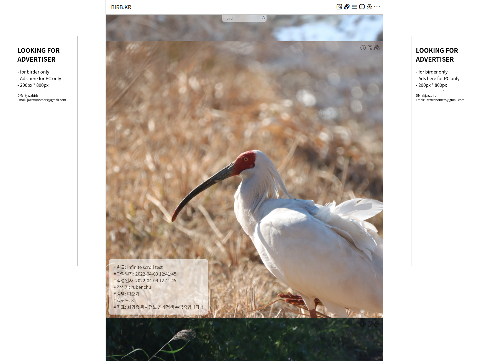
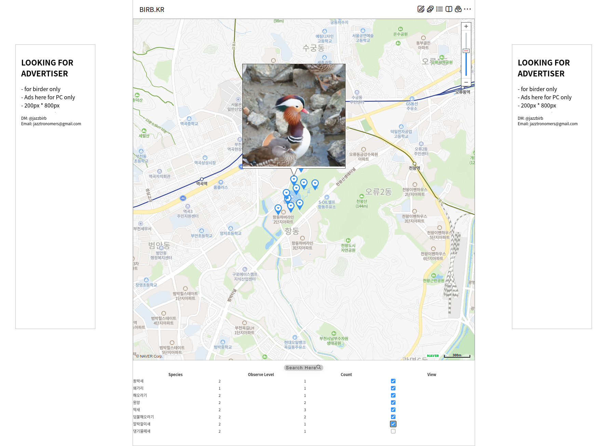
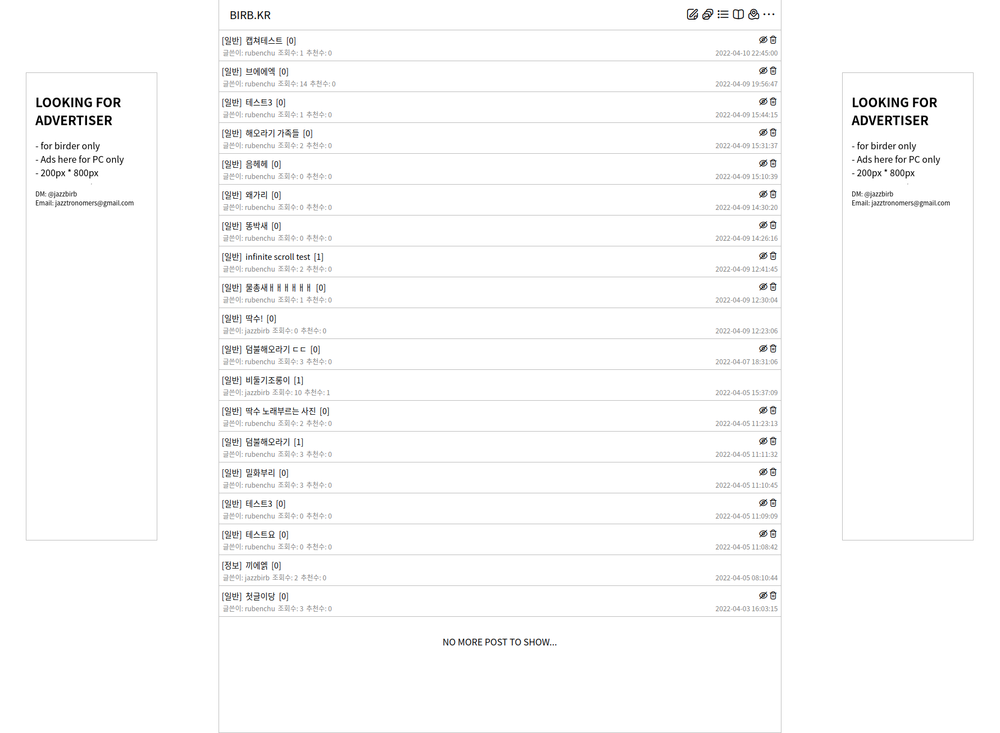
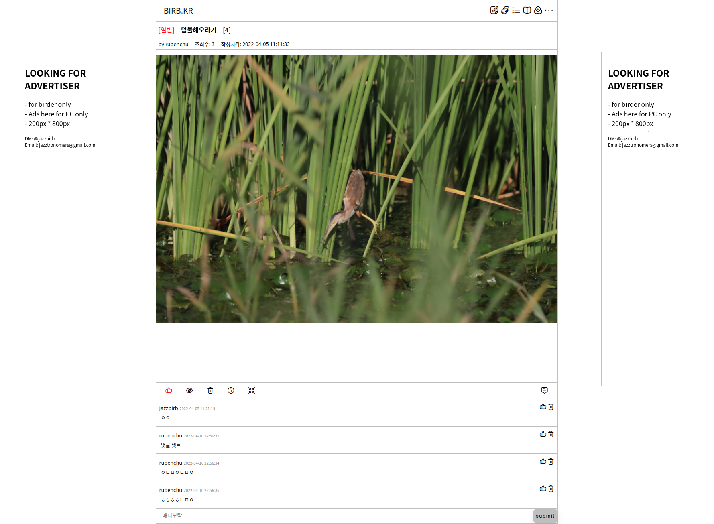
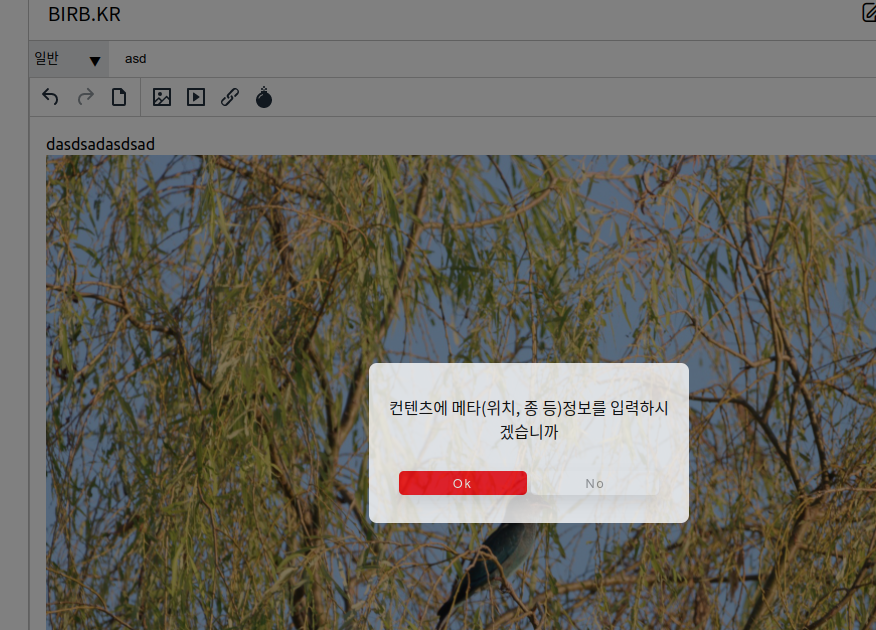
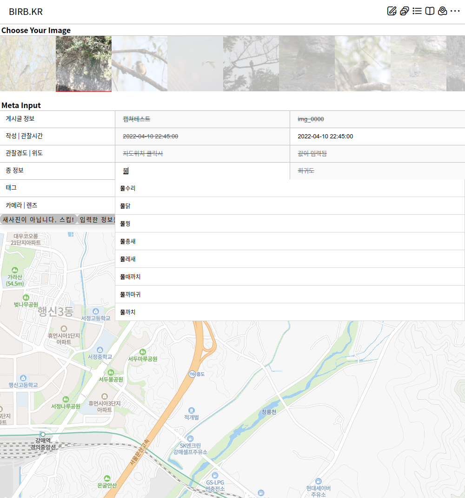

## BIRB.KR?
인스타그램 +  커뮤니티 기능 + 새 도감정보 + 촬영 위치정보 연동 등 기능으로 구성된 웹앱, 4월중 오픈예정

#### ARCHITECTURE 구성요소

MONGO DB, FLASK, AWS EC2, AWS SQS, AWS SNS, AWS S3

---

#### SAMPLE - 220410 update

광고컴포넌트추가 (fixed + infinite scroll inline) 나중에 adsense 적용  
자기글 삭제 버튼 추가  
이미지 버튼 추가 (information, go to post, go to location)  
메타정보입력창 추가  
글로벌 alert, confirmation 함수 override, modal + dim layer 적용    

---
## BEFORE 220410
#### SAMPLE - gallery

---

#### SAMPLE - editor

tinyMCE 사용

---

#### SAMPLE - board

---

#### SAMPLE - post

---

#### SAMPLE - meta

---

#### SAMPLE - user

